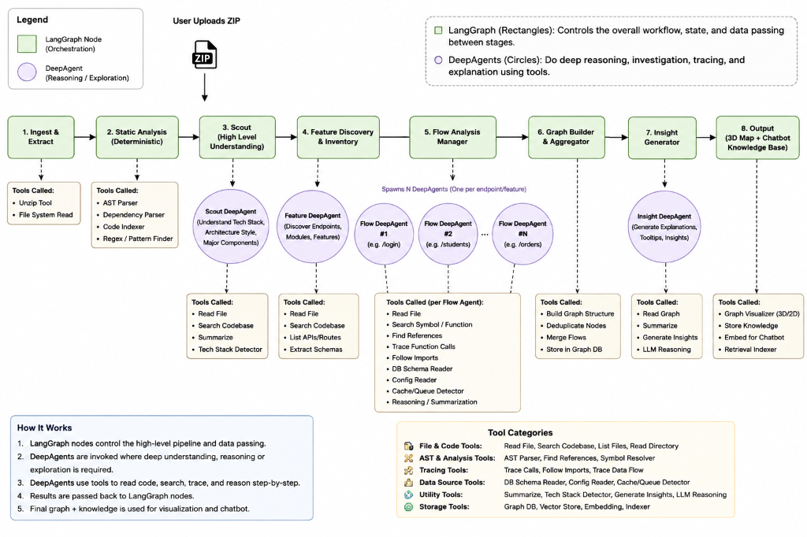

# ⚡ Hover — Autonomous Codebase Architecture & Flow Visualizer

> Upload any codebase ZIP. Hover deploys an **8-Stage LangGraph Pipeline** and **Autonomous DeepAgents** to reverse-engineer the system, trace end-to-end request lifecycles, and render interactive **3D Depth-Layered Dataflows** and **System Design Maps**.

---

## 🏗️ Architecture & Multi-Agent Pipeline

Hover combines **deterministic static analysis (AST parsing)** with an **autonomous multi-agent system** powered by **LangGraph** and **LangChain DeepAgents**.



### 🧩 How It Works: LangGraph + DeepAgents Architecture

| Component Type | Visual Indicator | Role & Responsibility |
|---|---|---|
| 🟩 **LangGraph Nodes** | **Rectangles** | Controls the high-level workflow DAG, pipeline state, error recovery, and data handoff between stages. |
| 🟪 **DeepAgents** | **Circles** | Autonomous reasoning agents (`deepagents.create_deep_agent`) that use specialized toolkits to explore, trace, and explain code dynamically. |

---

## 🤖 The 8-Stage Autonomous Pipeline Explained

### 1. Ingest & Extract (LangGraph Node)
* **Goal**: Safely unpack the uploaded ZIP archive into an isolated project workspace.
* **Tools**: Unzip utility, filesystem sanitizer.
* **Data Emitted**: Verified directory tree, project file listing.

### 2. Deterministic Static Analysis (LangGraph Node)
* **Goal**: Fast, deterministic AST (Abstract Syntax Tree) and regex parsing across all source files.
* **Tools**: Python AST parser, JavaScript/TypeScript symbol extractors, FastRoute regex parsers.
* **Data Emitted**: Function signatures, class definitions, imports, database models, and route decorators (`@app.get`, `@router.post`, `@router.put`, `@router.delete`).

### 3. Scout DeepAgent (High-Level Understanding)
* **Goal**: Form a high-level architectural mental model of the codebase.
* **Agent Behavior**: Reads configuration files (`pyproject.toml`, `package.json`, `settings.py`, `.env`), determines the primary language, frameworks, and architecture pattern (e.g. Layered MVC, Clean Architecture, Microservices).
* **Tools Used**: `read_file`, `search_codebase`, `tech_stack_detector`, `summarize`.

### 4. Feature Discovery DeepAgent (Endpoint & Feature Inventory)
* **Goal**: Catalog every user-facing feature, API route, and background task.
* **Agent Behavior**: Correlates discovered route symbols with controller handlers, extracts HTTP methods, path parameters, and request/response payloads.
* **Tools Used**: `get_routes`, `search_symbol`, `extract_schemas`, `read_file`.

### 5. Flow Analysis Manager & N Parallel Flow DeepAgents
* **Goal**: Deeply trace the exact runtime path of every single endpoint.
* **Agent Behavior**: Spawns **$N$ dedicated Flow DeepAgents** (one per discovered endpoint/feature) running in parallel. Each agent begins at the route handler and autonomously traces:
  $$\text{User Request} \longrightarrow \text{API Gateway / Router} \longrightarrow \text{Business Logic Service} \longrightarrow \text{Cache (Redis)} \longrightarrow \text{Database (SQL/ORM)}$$
* **Tools Used**: `trace_function_calls`, `follow_imports`, `get_function_body`, `db_schema_reader`, `cache_queue_detector`.

### 6. Graph Builder & Aggregator (LangGraph Node)
* **Goal**: Consolidate $N$ individual execution flows into a unified, clean architecture graph.
* **Responsibilities**: Deduplicates shared infrastructure nodes (e.g. common Database or Auth Middleware), normalizes edge connections, and structures the graph payload for React Flow.

### 7. Insight DeepAgent (Architectural & Security Reasoning)
* **Goal**: Inspect each edge and component connection to extract deeper architectural wisdom.
* **Agent Behavior**: Analyzes performance bottlenecks, atomic transactions, caching policies, authentication boundaries, and security considerations across every flow hop.
* **Tools Used**: `read_graph`, `generate_insights`, `pattern_analyzer`, `llm_reasoning`.

### 8. Output Generator & Knowledge Store (LangGraph Node)
* **Goal**: Package and store the verified graph models into the database and vector store.
* **Artifacts Produced**:
  - Interactive **3D Depth-Layered Flow Diagram**
  - **System Design Map** with 5-tier pipeline layout
  - **Class / Component Dependency Graph**
  - RAG Index for the **AI Assistant Chatbot**

---

## 🛠️ DeepAgent Tool Ecosystem

The DeepAgents interact with the codebase using an extensible set of categorized tools:

```text
📁 File & Code Tools       ➜ read_file, search_codebase, list_files, read_directory
🔬 AST & Analysis Tools     ➜ get_routes, get_function_body, search_code, get_dependencies
🛰️ Tracing Tools           ➜ trace_calls, follow_imports, trace_data_flow
🗄️ Data Source Tools       ➜ db_schema_reader, config_reader, cache_queue_detector
💡 Utility Tools           ➜ tech_stack_detector, generate_insights, llm_reasoning
📦 Storage Tools           ➜ graph_db, vector_store, embedding_indexer
```

---

## ✨ Key Features & User Interface

### 🌐 3D Depth-Layered Flows Diagram
* **Physical Z-Axis Tier Separation**: Infrastructure layers sit at distinct Z-depths (User at `0px`, Gateway at `-120px`, Services at `-360px`, Database at `-600px`).
* **Full 3D Orbit Controls**:
  - `↑` / `↓` : Pitch and tilt perspective to inspect layer gaps without wire overlap.
  - `←` / `→` : Orbit 3D angle.
  - `W` / `S` : Zoom through the Z-axis.
  - `+` / `-` : Spread or flatten layer depth.
  - `R` : Reset 3D camera.

### 📊 Animated Bottom Insight Inspector
* Hovering over any dataflow edge or label slides up an animated bottom inspector bar displaying real-time data payloads, design patterns (e.g., Cache-Aside, Atomic Transaction), and security notes without obstructing the canvas.

### 📐 System Design Map
* A dedicated full-width system design viewer breaking down:
  1. **5-Tier Architecture** (Client ➔ Gateway ➔ Services ➔ Cache/Queue ➔ Persistence)
  2. **Categorized Tech Stack** (Languages, Frameworks, Caching, Databases)
  3. **Architectural Principles & Design Patterns** (Repository Pattern, CQRS, ACID Transactions)
  4. **Database Schemas & Relational Entities**

### 💬 Grounded AI Codebase Assistant
* Chat with an AI assistant that possesses direct access to the parsed AST symbols, file chunks, and flow lifecycles via hybrid semantic RAG.

---

## 🚀 Quickstart Guide

### Prerequisites
- **Python 3.11+**
- **Node.js 18+** & `npm`

### 1. Backend Setup

```bash
# Navigate to project root
cd /Users/sameetpatro/Desktop/Projects/Hover

# Activate virtual environment
source .venv/bin/activate

# Install dependencies
pip install -r backend/requirements.txt

# Start backend server
cd backend
export PYTHONPATH=.
uvicorn app.main:app --reload --host 127.0.0.1 --port 8000
```

### 2. Frontend Setup

```bash
# In a new terminal window:
cd /Users/sameetpatro/Desktop/Projects/Hover/frontend

# Install dependencies & run dev server
npm install
npm run dev
```

Open **[http://localhost:5173](http://localhost:5173)** in your browser.

---

## ⚙️ Environment Variables (`.env`)

To enable OpenRouter LLM reasoning for the DeepAgents, create a `.env` file in the root directory:

```env
OPENROUTER_API_KEY=sk-or-v1-your-openrouter-key-here
OPENROUTER_BASE_URL=https://openrouter.ai/api/v1
OPENROUTER_CHAT_MODEL=openai/gpt-4o-mini
OPENROUTER_EMBEDDING_MODEL=openai/text-embedding-3-small
```
