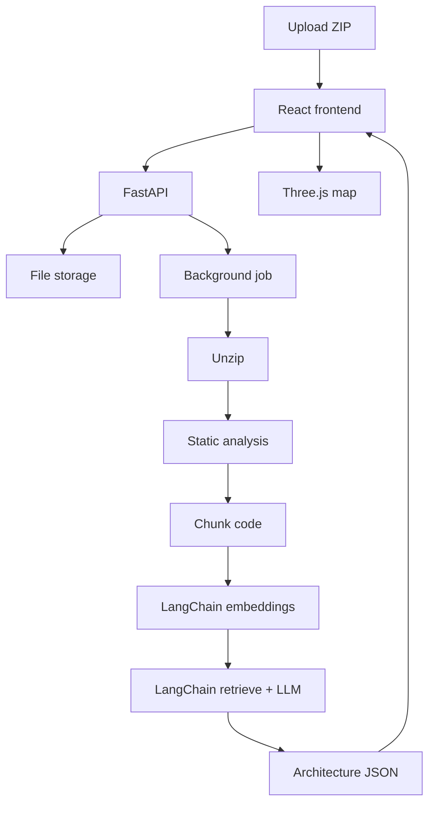

# How Hover Works

Plain-language guide to the project.

---

## What is Hover?

You upload a ZIP of your code. Hover reads it with **Python (FastAPI + LangChain)**, figures out how the system is built, and shows a **3D animated map** in React + Three.js.

---

## System design

```text
Browser (React + Three.js)
        │
        ▼
   FastAPI (/api/...)
        │
        ├── save ZIP (disk or MinIO/S3)
        └── start job (thread or Redis)
                │
                ▼
         Analysis pipeline
           extract → detect → analyze
           → chunk → LangChain embed
           → RAG retrieve → Architecture JSON
                │
                ▼
         3D visualization
```



---

## Stack roles

| Piece | Role |
|-------|------|
| **FastAPI** | HTTP API the frontend talks to |
| **LangChain** | Embeddings + chat LLM (via OpenRouter) to refine architecture |
| **SQLite / Postgres** | Projects, jobs, chunks, architecture JSON |
| **Redis** | Optional job queue (not needed locally) |
| **React + Three.js** | Upload UI + cinematic 3D map |

### Redis?

- Local: `WORKER_EAGER=true` → job runs in a **background thread**. No Redis needed.
- Docker/prod: Redis list `hover:jobs` + `python -m app.worker`.

### Kafka?

Not used. Redis (or eager threads) is the queue.

---

## LangChain in this project

File: `backend/app/services/rag.py`

1. `OpenAIEmbeddings` → OpenRouter → vectors for each code chunk  
2. Retrieve top chunks by cosine similarity  
3. `ChatOpenAI` → OpenRouter → refine Architecture JSON  

If `OPENROUTER_API_KEY` is empty → local hash embeddings + heuristic JSON (still works).

---

## Folders

```text
backend/app/
  main.py              FastAPI app
  routers/api.py       /api routes
  services/
    pipeline.py        full analysis job
    analysis.py        imports / symbols / graph
    rag.py             LangChain embeddings + LLM
    architecture.py    Architecture JSON builder
    worker.py          eager thread or Redis
    storage.py         ZIP save/load
frontend/              React + Three.js
```

---

## Run

```bash
source .venv/bin/activate
cd backend && PYTHONPATH=. uvicorn app.main:app --reload --port 8000

cd frontend && npm run dev
```

Upload `fixtures/sample_app.zip`.

---

## Mental model

```text
ZIP → files → graph + chunks → LangChain vectors → Architecture JSON → 3D story
```
